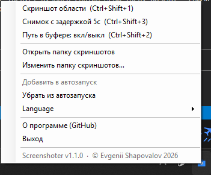
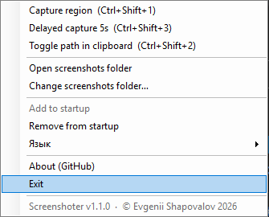

# Screenshoter - fast Windows screenshot tool

**Screenshoter** is a lightweight Windows tray app for quick screenshots. It captures a selected region (optionally with a countdown delay so you can catch a tooltip before it vanishes), saves a PNG file, and puts **both the image and the file path** on the clipboard.

It is built for people who need screenshots in chats, bug reports, documentation, terminals, Markdown files, IDEs, support tools, and issue trackers without opening a heavy editor or uploading anything to the cloud.

## Download

For normal use, download the ready-made executable from GitHub Releases:

- Latest release page: [GitHub Releases](https://github.com/e-u-shapovalov/screenshoter/releases/latest)
- Direct download: [Screenshoter.exe](https://github.com/e-u-shapovalov/screenshoter/releases/latest/download/Screenshoter.exe)

Do **not** use `Code -> Download ZIP` if you only want to run the app. That downloads the source code, not the ready-to-use program.

## Quick Start

1. Download `Screenshoter.exe`.
2. Put it into any folder you like.
3. Run it.
4. Find the Screenshoter icon in the Windows system tray.
5. Press `Ctrl+Shift+1` to capture a region, or `Ctrl+Shift+3` for a delayed capture with a countdown.
6. Press `Ctrl+V` where you need the result. Image-friendly apps will paste the screenshot; text fields and terminals usually paste the saved file path. If an app pastes the path instead of the image, press `Ctrl+Shift+2` to drop the path and keep only the picture.

No installer and no admin rights are required. Windows SmartScreen may warn because the binary is unsigned. If you trust this repository, choose **More info** and then **Run anyway**, or build the executable yourself.

## Features

- Region screenshot with `Ctrl+Shift+1`. The selection overlay shows a bright yellow crosshair cursor (clearly visible over the dimmed background) and snaps to edges: the frame magnetizes to the nearest color boundary under the cursor, so you can line up buttons, windows, and blocks precisely.
- Delayed capture with a countdown: `Ctrl+Shift+3` — select an area, set the seconds, hover the element and let the timer fire. Perfect for catching tooltips and hover popups that disappear on click or key press.
- Clipboard path toggle: `Ctrl+Shift+2` — drop the file path so only the image stays on the clipboard (handy for chats like WhatsApp or ChatGPT that paste the path instead of the picture), then bring it back without taking a new shot.
- Timestamped PNG files.
- Clipboard contains both the bitmap image and the saved file path.
- A short flash highlights the captured area.
- Configurable screenshots folder.
- Optional startup shortcut.
- Russian and English UI.
- Multi-monitor and DPI-aware behavior.
- Single small `.exe`, no external dependencies.

## What It Is Not

Screenshoter is not an image editor, OCR tool, video recorder, cloud uploader, or annotation suite. It is intentionally small: capture, save, copy, continue working.

## Tray Menu

Right-click the tray icon to:

- capture a region;
- capture with a delay (countdown);
- toggle the file path in the clipboard;
- open the screenshots folder;
- change the screenshots folder;
- add or remove the app from Windows startup;
- switch language;
- open the GitHub page;
- exit the app.

Double-clicking the tray icon starts region capture.

## Screenshots

Tray menu in Russian and English:





## Build From Source

```powershell
git clone https://github.com/e-u-shapovalov/screenshoter.git
cd screenshoter
.\build.ps1
.\Screenshoter.exe
```

Requirements:

- Windows;
- .NET Framework 4.x;
- `C:\Windows\Microsoft.NET\Framework64\v4.0.30319\csc.exe`.

No modern .NET SDK is required when the .NET Framework compiler is available.

## Troubleshooting

If hotkeys do not work, another app probably owns them. Check Yandex Disk, OneDrive, ShareX, Lightshot, recorder overlays, GPU utilities, or similar software. Free `Ctrl+Shift+1` and `Ctrl+Shift+3`, then wait a few seconds.

If the app seems invisible after launch, check the Windows system tray near the clock, including hidden tray icons.

If a screenshot is not saved, choose another screenshots folder from the tray menu and make sure Windows allows writing there.

## License

MIT License. Author: Evgenii Shapovalov.

Issues and feedback: [GitHub Issues](https://github.com/e-u-shapovalov/screenshoter/issues).
