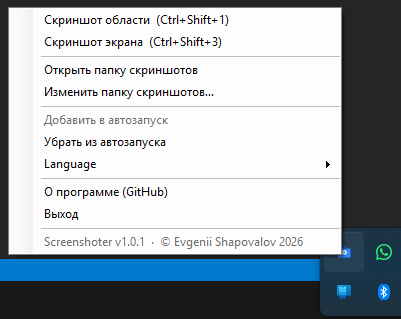
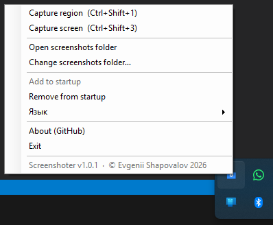

# Screenshoter - быстрый скриншотер для Windows

**Screenshoter** - маленькая программа для скриншотов на Windows. Она живет в системном трее, делает снимок выделенной области или экрана под курсором, сохраняет PNG и сразу кладет в буфер обмена **и картинку, и путь к файлу**.

Это удобно, когда нужно быстро вставить изображение в чат, документ или редактор, а путь к файлу - в терминал, баг-репорт, Markdown, IDE, CRM или другую программу.

[English README](README.en.md)

## Скачать за 10 секунд

**Обычному пользователю нужен готовый файл `Screenshoter.exe`, а не исходный код.**

1. Откройте страницу релизов: [GitHub Releases](https://github.com/e-u-shapovalov/screenshoter/releases/latest).
2. В блоке **Assets** нажмите **`Screenshoter.exe`**.
3. Запустите скачанный файл.
4. Если Windows SmartScreen покажет предупреждение для неподписанного файла: нажмите **Подробнее** и затем **Выполнить в любом случае**, если вы доверяете этому репозиторию.

Прямая ссылка на последнюю готовую версию: [скачать Screenshoter.exe](https://github.com/e-u-shapovalov/screenshoter/releases/latest/download/Screenshoter.exe)

Важно: если вы просто хотите пользоваться программой, **не нажимайте `Code -> Download ZIP`** и не скачивайте `Source code`. Эти архивы нужны разработчикам, а не для обычного запуска.

Подробная инструкция для новичков: [DOWNLOAD.md](DOWNLOAD.md)

Установка, удаление и сборка: [INSTALL.md](INSTALL.md)

## Что делает программа

Screenshoter решает простую задачу: сделать скриншот без лишних окон, сохранить его как файл и сразу подготовить к вставке.

Основные сценарии:

- быстро отправить фрагмент экрана в мессенджер или рабочий чат;
- сделать снимок ошибки и вставить его в баг-репорт;
- получить путь к PNG-файлу для CLI, Markdown, редактора или системы заявок;
- снять экран конкретного монитора в multi-monitor setup;
- пользоваться скриншотером без аккаунта, облака, установщика и тяжелого интерфейса.

## Ключевые возможности

- Снимок выделенной области: `Ctrl+Shift+1`.
- Снимок монитора под курсором: `Ctrl+Shift+3`.
- Сохранение в PNG с именем вида `2026-06-09_22-30-15.png`.
- Буфер обмена получает сразу два формата: изображение и текстовый путь к файлу.
- Папка скриншотов настраивается через меню в трее.
- По умолчанию файлы сохраняются в `%USERPROFILE%\Screenshots`.
- Автозапуск включается и выключается из меню.
- Интерфейс на русском и английском языках.
- Корректная работа с масштабированием экрана и несколькими мониторами.
- Один маленький `Screenshoter.exe`, без установщика и без внешних зависимостей.

## Чем быстрее ручного способа

Обычный путь часто выглядит так: открыть стандартный инструмент, выделить область, сохранить файл, найти его в проводнике, скопировать путь или заново вставить изображение. Screenshoter сокращает это до одного хоткея: PNG уже сохранен, картинка уже в буфере, путь к файлу тоже уже в буфере.

## Горячие клавиши

| Клавиши | Действие |
| --- | --- |
| `Ctrl+Shift+1` | Снимок области. Выделите прямоугольник мышью. `Esc` или правая кнопка мыши отменяют снимок. |
| `Ctrl+Shift+3` | Снимок экрана того монитора, на котором находится курсор. |

Если эти сочетания уже заняты другой программой, например Яндекс.Диском, освободите их там. Screenshoter периодически повторяет регистрацию горячих клавиш и начнет работать, когда сочетания станут свободны.

## Меню в трее

После запуска программа не открывает большое окно. Ищите значок Screenshoter в системном трее Windows рядом с часами.

В меню доступны:

- сделать снимок области;
- сделать снимок экрана;
- открыть папку скриншотов;
- изменить папку скриншотов;
- добавить программу в автозапуск;
- убрать программу из автозапуска;
- переключить язык: русский / English;
- открыть страницу проекта на GitHub;
- выйти из программы.

Двойной клик по значку в трее запускает снимок области.

## Скриншоты интерфейса

Меню в трее — русский и английский интерфейс:





## Кому подойдет

Screenshoter полезен разработчикам, тестировщикам, техническим писателям, менеджерам поддержки, авторам документации и всем, кому часто нужны быстрые снимки экрана с готовым путем к файлу.

Особенно хорошо подходит для:

- bug report screenshot;
- скриншот ошибки Windows;
- снимок области экрана;
- быстрый PNG screenshot;
- вставка скриншота в чат;
- копирование пути к скриншоту;
- легкий screenshot tool for Windows.

## Кому не подойдет

Screenshoter не является графическим редактором. В нем нет стрелок, рамок, OCR, записи видео, облачной синхронизации, истории снимков и встроенной публикации по ссылке. Если нужен комбайн для аннотаций и облака, лучше выбрать другой инструмент. Если нужен быстрый локальный скриншотер без лишнего, Screenshoter закрывает именно эту задачу.

## Установка для обычного пользователя

1. Скачайте [Screenshoter.exe](https://github.com/e-u-shapovalov/screenshoter/releases/latest/download/Screenshoter.exe).
2. Переместите файл в удобную папку, например `C:\Users\<ваше_имя>\Apps\Screenshoter\`.
3. Запустите `Screenshoter.exe`.
4. Найдите значок программы в трее.
5. Нажмите `Ctrl+Shift+1`, выделите область, отпустите мышь.
6. Вставьте результат через `Ctrl+V`: в чат вставится картинка, в текстовое поле или терминал обычно вставится путь к PNG.

Установка в систему не требуется. Администраторские права не нужны.

## Где находятся GitHub Releases

GitHub Releases - это раздел проекта, где лежат готовые версии программы.

Как открыть:

1. Перейдите на главную страницу репозитория: `https://github.com/e-u-shapovalov/screenshoter`.
2. Справа найдите блок **Releases**.
3. Нажмите на последний релиз.
4. Внутри релиза откройте **Assets**.
5. Скачайте **`Screenshoter.exe`**.

Еще раз: архивы **Source code (zip)** и **Source code (tar.gz)** не являются готовой программой для обычного пользователя.

## Сборка для разработчиков

Проект состоит из одного C#-файла и собирается встроенным компилятором .NET Framework.

```powershell
git clone https://github.com/e-u-shapovalov/screenshoter.git
cd screenshoter
.\build.ps1
.\Screenshoter.exe
```

Требования:

- Windows;
- .NET Framework 4.x;
- компилятор `C:\Windows\Microsoft.NET\Framework64\v4.0.30319\csc.exe`.

SDK .NET устанавливать не нужно, если этот компилятор уже есть в системе.

## Файлы проекта

| Файл | Назначение |
| --- | --- |
| `Screenshoter.cs` | Исходный код WinForms-приложения, трей, хоткеи, сохранение PNG, буфер обмена. |
| `build.ps1` | Сборка `Screenshoter.exe` через встроенный `csc.exe`. |
| `Screenshoter.exe` | Готовый исполняемый файл в рабочей копии репозитория. Для пользователей лучше скачивать версию из Releases. |
| `LICENSE` | MIT License. |
| `DOWNLOAD.md` | Инструкция скачивания для новичков. |
| `INSTALL.md` | Установка, удаление, автозапуск и сборка. |
| `RELEASES.md` | Информация о релизах и публикации новых версий. |

## Где хранятся настройки

- Папка скриншотов: `%APPDATA%\Screenshoter\folder.txt`.
- Язык интерфейса: `%APPDATA%\Screenshoter\lang.txt`.
- Ярлык автозапуска: `shell:startup\Screenshoter.lnk`.

## FAQ

### Почему после запуска нет окна?

Так и задумано. Screenshoter работает в трее. Проверьте область рядом с часами Windows и скрытые значки трея.

### Что скачивать: `Screenshoter.exe` или `Source code`?

Обычному пользователю нужен **`Screenshoter.exe`** из GitHub Releases. `Source code` нужен только тем, кто хочет читать или собирать код.

### Нужно ли устанавливать программу?

Нет. Это portable Windows-приложение: скачайте `Screenshoter.exe` и запустите.

### Нужны ли права администратора?

Нет. Для обычного запуска и сохранения скриншотов права администратора не нужны.

### Почему Windows показывает SmartScreen?

Файл не подписан платным code-signing сертификатом. Для маленьких open-source утилит это обычная ситуация. Скачивайте файл только со страницы Releases этого репозитория или соберите его сами из исходников.

### Можно ли изменить папку сохранения?

Да. Откройте меню в трее и выберите **Изменить папку скриншотов**.

### Что именно попадает в буфер обмена?

После снимка в буфере есть два формата: PNG-изображение и текстовый путь к сохраненному файлу. Разные приложения вставляют тот формат, который им подходит.

## Troubleshooting

### Не работают `Ctrl+Shift+1` или `Ctrl+Shift+3`

Скорее всего, сочетание занято другой программой. Проверьте Яндекс.Диск, OneDrive, ShareX, Lightshot, программы записи экрана, драйверы видеокарт и игровые оверлеи. Освободите сочетание и подождите пару секунд.

### Скриншот не сохраняется

Проверьте, существует ли папка сохранения и есть ли к ней доступ на запись. Через меню в трее выберите другую папку, например `%USERPROFILE%\Screenshots`.

### Вставляется путь, но не картинка

Значит приложение, куда вы вставляете, предпочло текстовый формат. Попробуйте вставить в графический редактор, Word, Paint, Telegram, Slack или другой чат. В терминалах и текстовых полях чаще вставляется путь.

### Вставляется картинка, но не путь

Это нормальное поведение для приложений, которые принимают изображения. Чтобы получить путь, вставьте буфер в текстовое поле, блокнот, адресную строку или терминал.

### Антивирус ругается на файл

`Screenshoter.exe` маленький, неподписанный и работает с экраном/буфером обмена, поэтому некоторые защитные системы могут относиться к нему осторожно. Проверьте, что файл скачан из [официальных Releases](https://github.com/e-u-shapovalov/screenshoter/releases/latest), или соберите его самостоятельно через `build.ps1`.

## SEO: что это за инструмент

Screenshoter - это легкий скриншотер для Windows, portable screenshot tool, программа для снимков экрана, утилита для скриншота области, инструмент для сохранения PNG и копирования пути к скриншоту. Проект полезен тем, кто ищет простой Windows screen capture tool без облака, регистрации и сложного интерфейса.

## Лицензия и автор

MIT License. Автор: Evgenii Shapovalov.

Обратная связь, ошибки и предложения: [GitHub Issues](https://github.com/e-u-shapovalov/screenshoter/issues).
